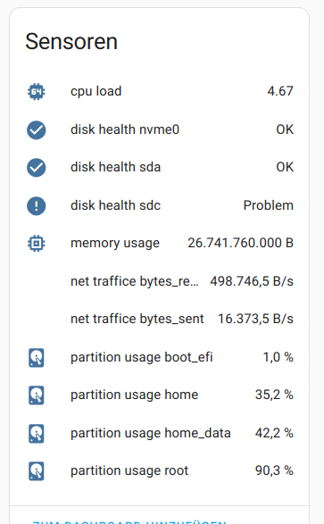
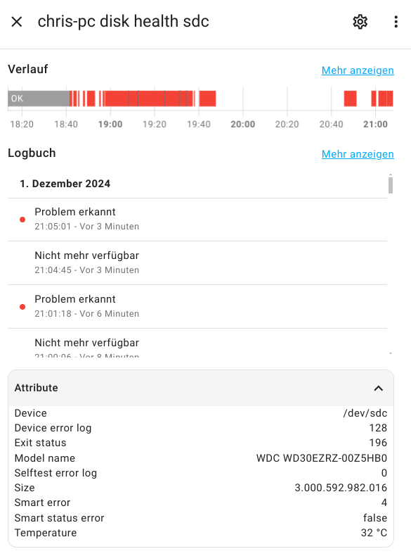

# HW2HA - Hardware to Home-Assistant by MQTT

### Sensors for
* Smart errors
* CPU load
* Memory usage
* Disk usage
* Network traffic rx/tx

### Installation

copy hw2ha.py to /opt/

`hw2ha.py --install-systemd-service` to install systemd service

`systemct enable --now hw2ha`

`hw2ha.py --clear-retain-config` to clean up Home-Assistant entities

### Config:

`MQTT_SERVER="home-assistant"`

